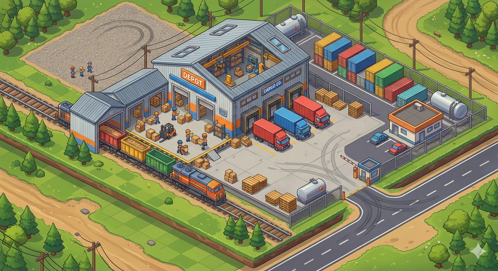

<div align="center">
  

  <h1>Loadout Depot</h1>
  <p>Bootstrap any project with Claude Code agents, skills, session templates, and a codebase context index — in a single command.</p>

  
  
  
  
</div>

---

## Install

**One-liner (recommended)**

```bash
curl -fsSL https://raw.githubusercontent.com/joe8628/loadout-depot/main/bootstrap.sh | bash
```

Clones the repo to `~/.rig` and symlinks `loadout-depot` into `~/.local/bin`. Re-running updates to the latest version.

**Manual**

```bash
git clone https://github.com/joe8628/loadout-depot.git ~/.rig
cd ~/.rig && make install
```

**PATH**

Make sure `~/.local/bin` is on your PATH:

```bash
export PATH="$HOME/.local/bin:$PATH"
```

Add that line to your `~/.bashrc` or `~/.zshrc`.

---

## Quick Start

```bash
cd ~/my-project
loadout-depot install
```

---

## Usage

```bash
loadout-depot install                        # Install for Claude Code (default)
loadout-depot install --target claude-code   # Explicit target
loadout-depot install --force                # Overwrite existing config files
loadout-depot install --dry-run              # Preview without writing files
loadout-depot install --no-hooks             # Skip pre-commit hook
loadout-depot install --no-codebase-index    # Skip ccindex init

loadout-depot list      # List available agents and skills
loadout-depot version   # Print version
loadout-depot help      # Print usage
```

---

## Requirements

- `bash` 5+
- `git`
- `claude` CLI — required for the Claude Code target
- `ccindex` — bundled via the `codebase-context/` submodule

---

## Documentation

Full specification: [`SPEC.md`](SPEC.md)
